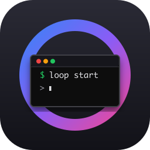

  

<h1 align="center">Loop</h1>

  Native macOS app for running autonomous Claude Code agent sessions across multiple projects.

  <a href="https://github.com/olekristianbe/loop/releases/latest">Download</a>

---

## Why Loop?

Loop is a desktop IDE for coding with Claude. Instead of juggling terminal windows and losing context, you get:

- **Work in the background** — Run Claude sessions while you do other things. Menu bar keeps you updated.
- **Multi-project workspace** — Switch between projects instantly. Each has its own history, config, and git integration.
- **Looping for iteration** — Run multiple cycles with validation between each. Perfect for complex refactoring or multi-step features.
- **Mac-native experience** — Real UI, notifications, drag-drop. Way better than terminal-only.
- **Structured workflow** — Plan, Research, Build, Review keeps Claude focused and context-efficient.
- **GitHub integration** — Generate commits and PRs directly from the app.

## Features

- **Multi-project management** — Add, organize, and run sessions across your codebases
- **4-phase workflow** — Plan, Research, Build, Review
- **Loop-based execution** — Run multiple iterations with validation between each
- **Stream output** — Real-time display of tool use, results, and assistant text
- **Session history** — Track past runs with git diffs and commit summaries
- **Menu bar** — Quick status view and controls from the system tray
- **Chat input** — Send messages to Claude anytime during a session
- **Image attachments** — Drag-drop screenshots for visual context

## How It Works

Loop uses a structured 4-phase workflow that keeps Claude focused and prevents context overload:

**Plan** — Interactive Q&A session where you dump ideas, bugs, or features. Claude asks clarifying questions and generates a detailed spec with acceptance criteria.

**Research** — Claude fetches official documentation and enriches your spec with API details, code patterns, warnings, and best practices.

**Build** — Execute the spec step-by-step with fresh context for each task. Validates after each change (build, test, lint). Can loop multiple times until all tasks are done.

**Review** — Claude scans the changes for bugs, verifies against documentation, checks for edge cases, and reports issues to feed into the next cycle.

## Install

1. Download the latest `.dmg` from [Releases](https://github.com/olekristianbe/loop/releases/latest)
2. Open the DMG and drag Loop to Applications
3. Launch Loop

## Requirements

Loop requires the Claude Code CLI. Install it first:

1. Install from [claude.ai/code](https://claude.ai/code)
2. Run `claude --version` to verify
3. Configure your API key following the setup instructions

**System requirements:**
- macOS 15.0 (Sequoia) or later
- Apple Silicon or Intel Mac

## Updates

Loop checks for updates automatically and notifies you when a new version is available. You can also check manually via Loop > Check for Updates.

## Support

- [Report Issues](https://github.com/olekristianbe/loop/issues)
- [Discussions](https://github.com/olekristianbe/loop/discussions)

## License

Copyright 2026 Lytic AS. All rights reserved. Source code is not included in this distribution.
