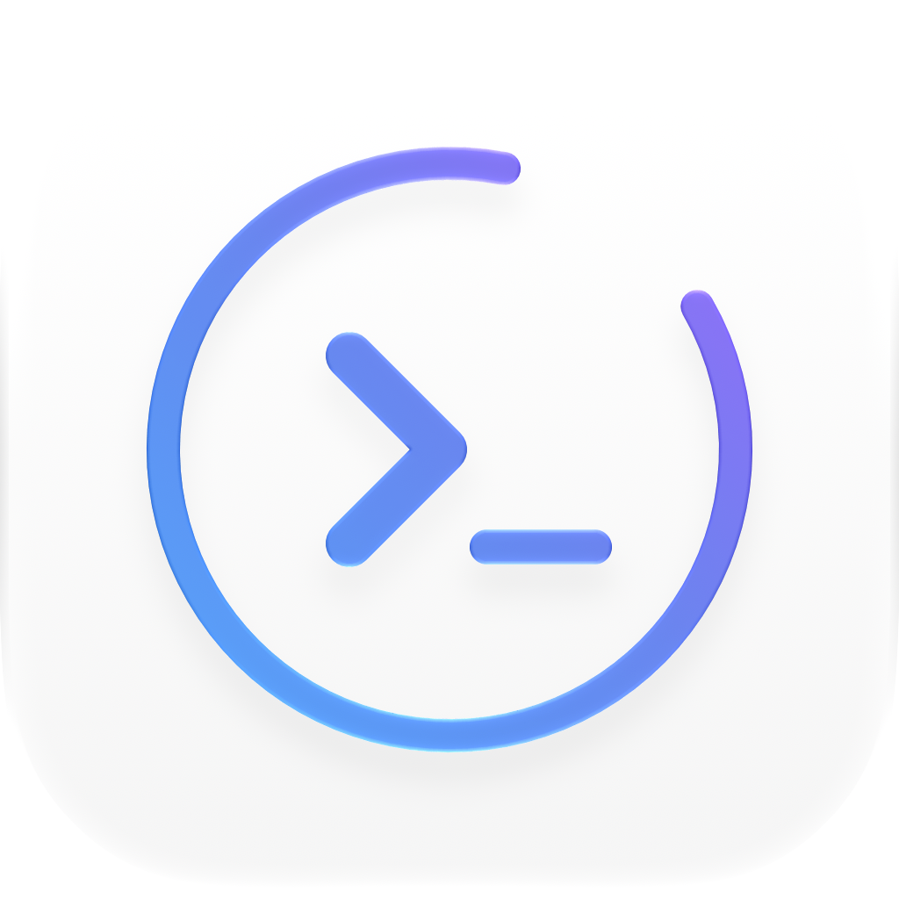

  

<h1 align="center">Loop</h1>

  A native Mac workspace for Claude and Codex.

  <a href="https://github.com/olekristianbe/loop/releases/latest">Download Loop</a>

---

Loop brings your coding agents, projects, terminals, and Git into one fast Mac
app. It keeps working when you close its window, and you can use it on one Mac
from another.

## Install

The latest stable release represented by this distribution commit is v2.0.2.

1. Download the latest `.dmg` from the
   [Releases page](https://github.com/olekristianbe/loop/releases/latest).
2. Open it and drag Loop to Applications.
3. Open Loop.

## Requirements

- An Apple silicon Mac with macOS 15 or newer.
- At least one agent, installed and signed in:
  - **Claude Code**, with Node.js;
  - **Codex**.

## Updates

Loop checks for updates by itself. When one is ready, it shows at the bottom of
the sidebar. You can also choose **Loop › Check for Updates…**.

## Support

- [Report an issue](https://github.com/olekristianbe/loop/issues)
- [Discussions](https://github.com/olekristianbe/loop/discussions)

## License

Copyright 2026 Lytic AS. All rights reserved. Source code is not included in
this distribution.
